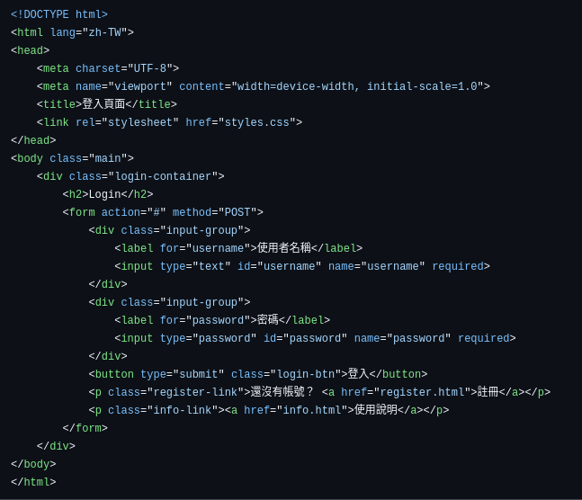
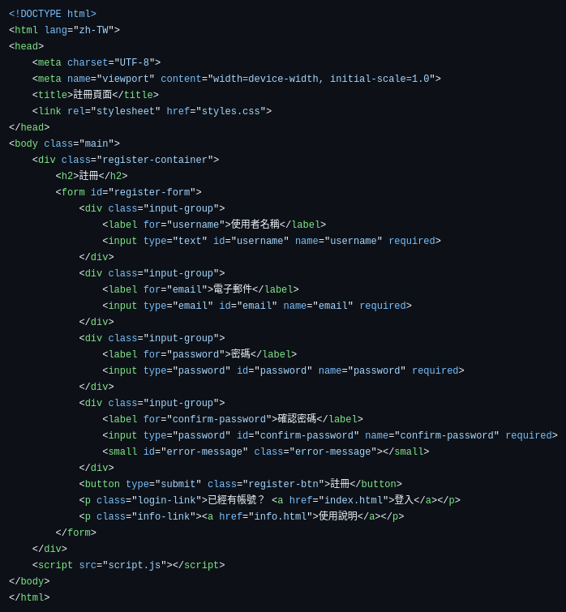
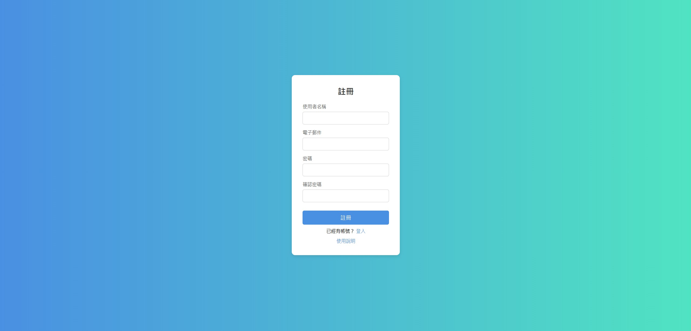
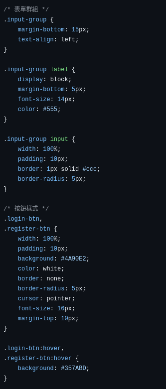
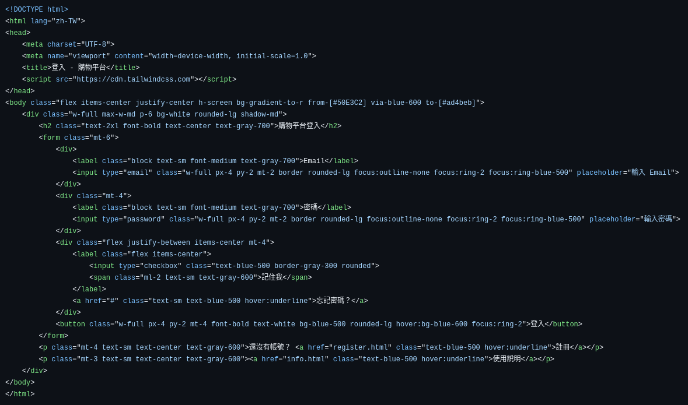
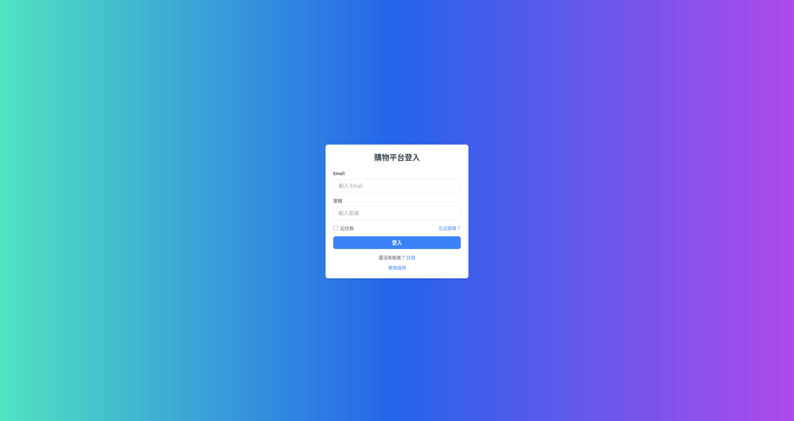
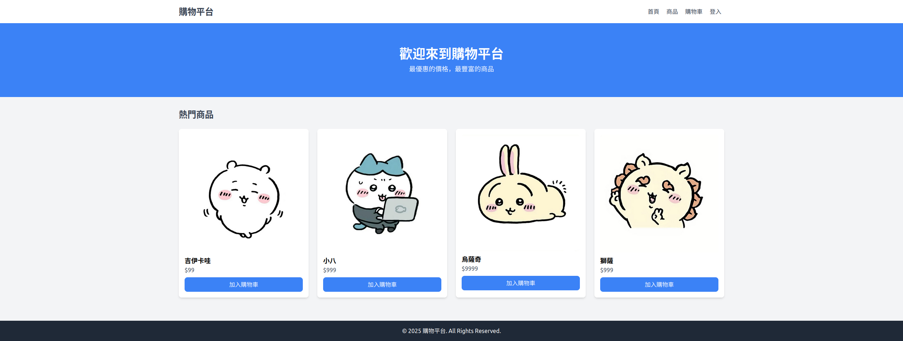

# Web Week3 Homework - Team 7

### File structure

```

└── HW_Report/
    ├── home.html (home page)
    ├── info.html (info page)
    ├── login.html (login page)
    ├── register.html (register page)
    ├── script.js
    ├── styles.css
    ├── Week03.md
    └── img/

```

### 當週上課的主題練習

- 使用 html 實作簡單的 user login page </br>
  Login page code: </br>
   </br>
  Login page screenshot </br>
   </br>
- 使用 html 實作簡單的 user register page </br>
  Register page : </br>
   </br>
  Register page screenshot </br>
   </br>
- 使用 css 美化並統一兩個 page 中各元件的 UI 樣式 </br>
  css screenshot (節錄): </br>
   </br>

### 與當週上課的主題相關的額外程式技術

**Tailwind css**

- 我們找到 tailwind css 這個套件，幫助我們在撰寫 UI 樣式時可以更加快速且直觀
- tailwind css 與一般 css 的差異分析
    
    
    | 特性 | Tailwind CSS | 一般手寫 CSS |
    | --- | --- | --- |
    | **開發速度** | 快速，使用 utility class | 較慢，需手動撰寫樣式 |
    | **可維護性** | 容易維護，不易樣式衝突 | 容易樣式污染，難以管理大型專案 |
    | **學習曲線** | 需要學習 Tailwind 類別 | 直接使用 CSS，較直覺 |
    | **可重複使用性** | 透過 `@apply` 可部分重複使用 | 可透過 class 重複使用 |
    | **HTML 可讀性** | class 可能過長，影響可讀性 | HTML 簡潔，CSS 另行管理 |
    | **響應式設計** | 內建 `sm:`, `md:` 等工具類別 | 需手動撰寫 `@media` |
    | **適用專案** | 適合中大型專案或需快速開發的應用 | 適合小型專案或對樣式要求精細的應用 |
- 我們試著在同樣的 html 框架下，使用 tailwind css 改寫原本的 login page 與 register page </br>
    Login page tailwind css 版 (code): </br>
     </br>
    Login page tailwind css 版: </br>
     </br>
- 我們使用 html + tailwind css，直接實作出一個簡易購物平台 home page </br>
    Home page: </br>
     </br>

### 組員分工情況
- 陳星佑 25% github configuration, home page 製作
- 高永杰 25% tailwind css 改寫
- 渠景量 25% html + css 框架
- 林柏佑 25% 網頁使用說明