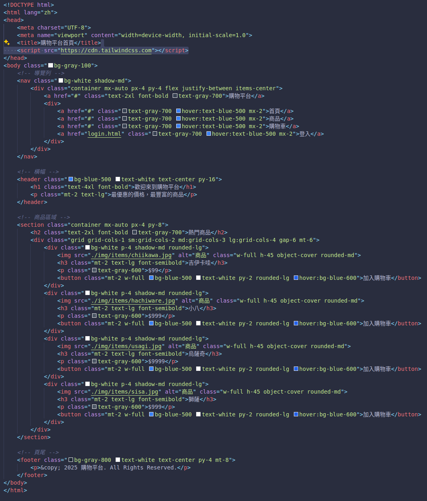
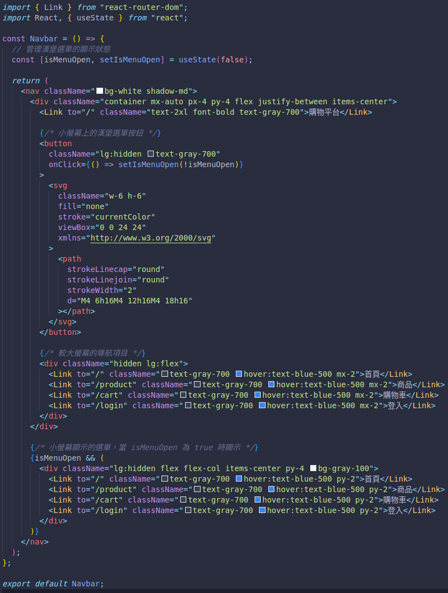
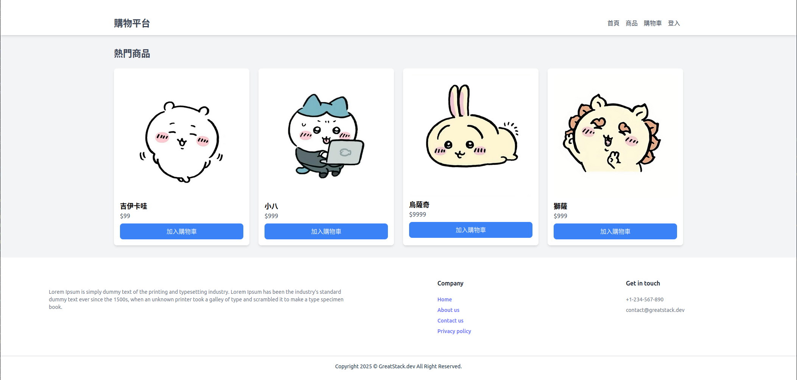
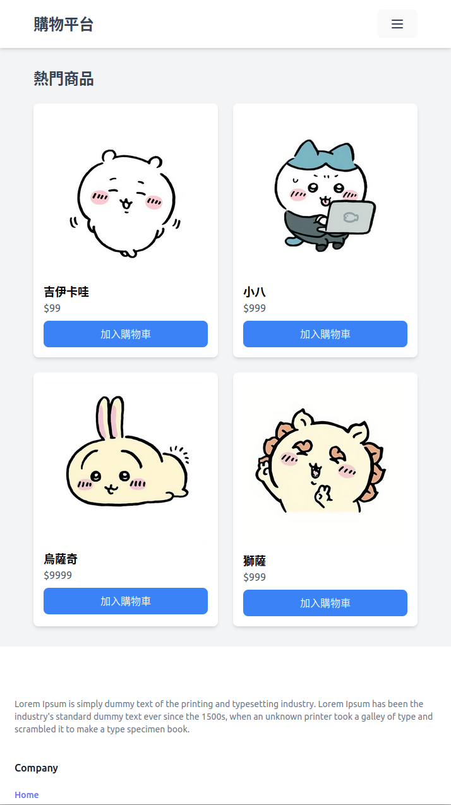

# Web Week5 Homework - Team 7

### File structure

```

└── HW_Report/
    └── my-shopping-platform
        ├── node_modules
        ├── public
        ├── src
        |   ├── assets
        |   |   └── (images)
        |   ├── components
        |   |   ├── Footer.jsx
        |   |   ├── HeadSlider.jsx
        |   |   └── Navbar.jsx
        |   ├── website
        |   |   ├── Home
        |   |   |   ├── Cart.jsx
        |   |   |   ├── Home.jsx
        |   |   |   └── Product.jsx
        |   |   ├── Login.jsx
        |   |   └── Register.jsx
        |   └── Entry pages (App.css, App.jsx, index.css, main.jsx)
        └── (Other files)
```

### 當週上課的主題練習

**React (Javascript)**

- 將 Week03 的網頁框架換成 React
    - 註冊頁面 </br>
    - 登入頁面 </br>
    - 主頁 </br>
    - Ex: Original home.html </br>
     </br>

    - Migrated home.jsx (React) </br>
     </br>

- 將常用物件以 React 方式包成 Component，以便重複利用
    - Navbar </br>
    - HeadSlider </br>
    - Footer </br>
    - Ex: Navbar component </br>
     </br>
  
- 以 React 撰寫新頁面
    - 購物車
    - 商品
    - Ex: 商品頁面 </br>
     </br>

### 與當週上課的主題相關的額外程式技術

**RWD webpage**

- 我們希望利用 React 與 Tailwind CSS 的特性，將網頁改寫成 RWD 形式，以讓網頁可以適應各式各樣的設備與畫面大小
- 有 / 無 RWD 設計網頁的差異分析
    
  | 特徵          | RWD（響應式網頁設計）                     | 非RWD（固定設計網頁）                     |
  |--------------|---------------------------------------|---------------------------------------|
  | **適應設備**   | 支援各種螢幕尺寸與設備，自動調整顯示效果    | 需要為每種設備製作不同版本                    |
  | **維護成本**   | 較低，因為只有單一版本                   | 較高，需要維護多個版本                      |
  | **SEO**       | 較好，只有一個URL                      | 較差，因為需要為不同設備創建不同URL            |
  | **使用體驗**   | 較佳，無論在手機、桌面都能提供一致體驗       | 可能在不同設備上有不一致的體驗               |
  | **開發難度**   | 較高，需要設計多種屏幕適應方案              | 較低，專注於某一設備                         |
  | **載入速度**   | 可能較慢，因為會加載不同解析度的資源         | 可能較快，無需多版本資源                     |

- Before RWD (碰到畫面寬度較小的設備，右側 UI 會被卡掉）
   </br>
- After RWD (可以順利在不同大小的畫面上顯示適合的 UI)
   </br>

### 組員分工情況
- 陳星佑 25% RWD design, Report writing
- 高永杰 25% Component extracting, React migrating
- 渠景量 25% React migrating
- 林柏佑 25% React migrating