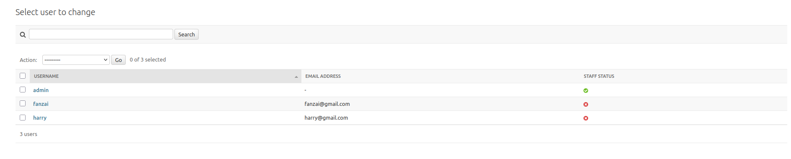
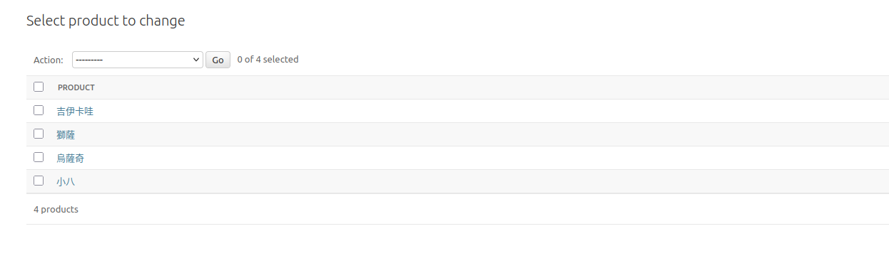

# Web Week7 Homework - Team 7


## ✅ 功能完成列表

### 前端（React + Vite + Tailwind）

- [x] 商品首頁展示（從後端 API 載入）
- [x] 商品加入購物車（含數量整合、不重複顯示）
- [x] 購物車功能：
  - [x] 數量 ± 按鈕
  - [x] 商品小計 / 購物車總金額
  - [x] 刪除商品
  - [x] `localStorage` 購物車保存
- [x] 使用者註冊頁面（支援驗證密碼一致）
- [x] 使用者登入頁面（JWT 驗證，登入後導回首頁）


### 後端（Django + Django REST framework + SimpleJWT）

- [x] 使用內建 `User` model 註冊 / 登入
- [x] JWT 驗證登入（`/api/token/`）
- [x] 自訂註冊 API（儲存 username / email / password + isSeller）
- [x] 商品資料 API（`/api/products/`）
- [x] 使用 `UserProfile` 擴充 User（新增欄位 `isSeller`）
- [x] Django admin 後台管理使用者與商品

### 🧱 專案結構
```txt
HW_Report/
├── my-shopping-platform/   # 前端 React 專案
│   ├── src/
│   │   ├── website/
│   │   │   ├── Home.jsx, Cart.jsx, Product.jsx
│   │   │   ├── Login.jsx, Register.jsx
│   │   ├── components/
│   │   ├── App.jsx, main.jsx
│
├── backend/                # 後端 Django 專案
│   ├── my_backend/
│   │   └── urls.py, settings.py
│   ├── api/
│   │   ├── models.py（Product, UserProfile）
│   │   ├── views.py（get_products, register_user 等）
│   │   ├── urls.py
│   │   ├── signals.py（同步 UserProfile）
```


## 當週上課的主題練習

### Docker

**Docker Image Pull 連結**
- ```https://hub.docker.com/repository/docker/poyucheese/web_team07/general```

**Docker啟動方式說明**

- Open Docker Desktop App (No need to sign in)
   </br>

- Set directory path
  ```sh
  cd HW_Report
  ```

- Clearing 8001 port (Update 0508)
  - Check if 8001 port is occupied
    ```sh
    sudo netstat -tulpn | grep :8001
    ```
  - If occupied by docker, find its container ID
    ```sh
    docker ps
    ``` 
  - Stop that docker container by its ID
    ```sh
    docker stop <container_id>
    ``` 

- Pull from docker hub
  ```sh
  docker pull poyucheese/web_team07:latest
  ```

- How to run
  ```sh
  docker run   --platform linux/arm64   -v $(pwd)/backend:/app/backend   -p 8001:8000   poyucheese/web_team07:latest   python /app/backend/manage.py runserver 0.0.0.0:8000
  ```

- 開啟瀏覽器輸入 127.0.0.1:8001/admin, Username 和 Password 分別輸入 admin 和 123456, 即可進入我們的 Django 資料庫後端


### React

- Set directory path
  ```sh
  cd HW_Report/my-shopping-platform
  ```

- Command
  ```sh
  npm run dev
  ```

- Click the given link
   </br>


### Django

- 建立 Django 後端架構 (詳細在 React 和 Django 整合部份)

- 建立 User 資料庫
  - 使用者從註冊頁面輸入
    - Username
    - Email
    - Password

   </br>
  
- 建立 Product 資料庫
  - 手動從後台加入 (之後會加入 IsSeller 功能)
    - Name
    - Price
    - Img

   </br>

## 與當週上課的主題相關的額外程式技術

### React 和 Django 整合

我們希望在保留原本專案  React 前端的同時，加入 Django 的後端框架

- ✅ 前端（React + Vite）
  - 使用 React 建立 SPA（單頁應用）
  - 使用 TailwindCSS 快速設計 UI
  - 所有畫面與資料互動皆透過 fetch 呼叫 Django 提供的 API

- ✅ 後端（Django + Django REST Framework）
  - Django 作為後端伺服器，使用 `djangorestframework` 建立 API
  - 提供 RESTful API，例如：
    - `/api/products/`：取得商品資料
    - `/api/register/`：註冊使用者
    - `/api/token/`：JWT 登入
    - `/api/profile/`：取得登入者資訊

- ✅ 整合方式
  - 前端透過 `fetch` 向 Django API 發送請求
  - Django API 回傳 JSON 給前端
  - 前端依據回傳資料更新畫面（例如商品列表、購物車）
  - JWT Token 實現登入驗證與授權（儲存在 `localStorage`）


### 登入流程（JWT）

我們使用 Django 內建的 `User` 模型（`django.contrib.auth.models.User`）來實作註冊與登入功能，並搭配 `SimpleJWT` 套件來實現安全的 Token 驗證登入機制。

**✅ 註冊功能（Register）**

- 我們在 `views.py` 中使用 `User.objects.create_user()` 建立帳號
- 該方法會自動幫使用者的密碼進行加密
- 並可同時儲存 username、email、password 等欄位

  ```python
  from django.contrib.auth.models import User

  @api_view(['POST'])
  def register_user(request):
      username = request.data.get('username')
      password = request.data.get('password')
      email = request.data.get('email')

      if User.objects.filter(username=username).exists():
          return Response({'error': '使用者已存在'}, status=400)

      user = User.objects.create_user(username=username, password=password, email=email)
      return Response({'message': '註冊成功'})
  ```


**✅ 登入功能（Login）**

- 我們使用套件 `djangorestframework-simplejwt` 提供的登入 API
- 使用者前端登入時，POST 請求到 `/api/token/`，Django 會自動驗證帳號密碼，並回傳 JWT token

  ```python
  # urls.py
  from rest_framework_simplejwt.views import TokenObtainPairView

  urlpatterns = [
      path('api/token/', TokenObtainPairView.as_view(), name='token_obtain_pair'),
  ]
  ```

- 回傳結果會包含：
  ```json
  {
    "access": "JWT Access Token",
    "refresh": "JWT Refresh Token"
  }
  ```
- 登入流程
  1. 使用者在 `/login` 頁面輸入帳密
  2. 前端送出 POST 到 `/api/token/`
  3. 成功後回傳 access token → 儲存到 `localStorage.token`
  4. 後續 API 可以用此 token 進行身份驗證


## 組員分工情況
- 陳星佑 25% Login/Register backend construction, write readme file
- 高永杰 25% Product database construction, write readme file
- 渠景量 25% Django/React integration 
- 林柏佑 25% Docker image construction


