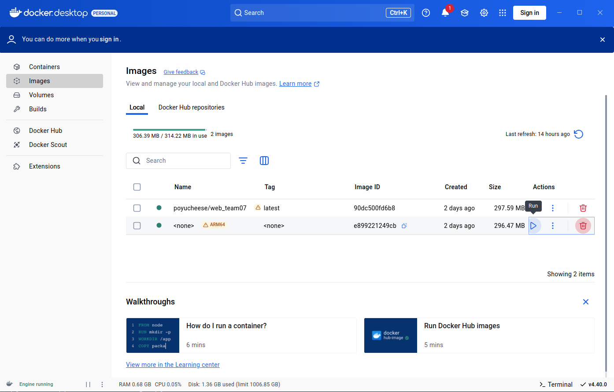
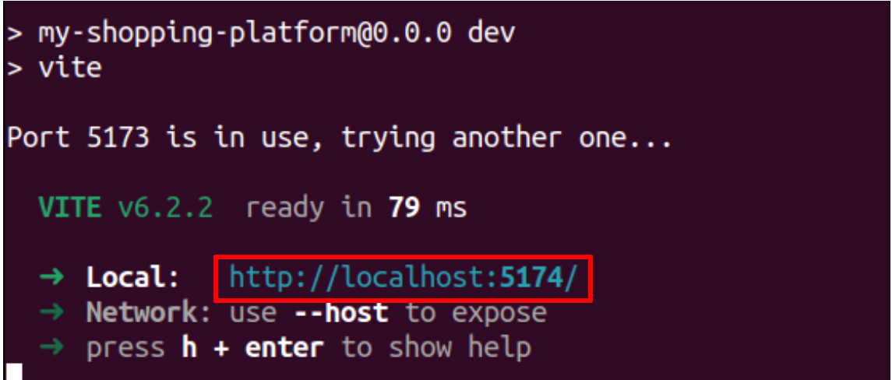

# Web Week11 Homework - Team 7

## How to run

### Docker
**Docker Image Pull 連結**
- Backend (Django) 
  ```https://hub.docker.com/repository/docker/ryan881225/backend-django/general```
- Database (MySQL) 
  ```https://hub.docker.com/repository/docker/ryan881225/hw-mysql/general```

**Docker啟動方式說明**

- Open Docker Desktop App (No need to sign in)
   </br>

- Set directory path
  ```sh
  cd HW_Report/backend
  ```

- Pull from docker hub and run docker
  ```sh
  docker compose up -d
  ```

- 複製資料檔到容器並進入容器
  ```sh
  docker cp data.json web_django:./data.json
  docker exec -it web_django bash
  ```

- 建立資料表和載入初始資料
  ```sh
  python manage.py migrate
  python manage.py loaddata data.json
  ```


- 開啟瀏覽器輸入 127.0.0.1:8001/admin, Username 和 Password 分別輸入 admin 和 123456, 即可進入我們的 Django 資料庫後端


### React

- Set directory path
  ```sh
  cd HW_Report/my-shopping-platform
  ```

- Command
  ```sh
  npm run dev
  ```

- Click the given link
   </br>

## 當週上課的主題練習

- 將 SQLlite 移植成 MySQL
- 完成 AJAX 功能，讓網頁在不刷新的情況下顯示加入購物車的狀態
- 以 WebSocket 串接 Server，提供 Client 與 Server 的雙向溝通渠道

## 與當週上課的主題相關的額外程式技術

### 註冊成為賣家功能 (isSellerButton)

- 我們希望在系統中區分出買家 / 賣家的身份，因此想要在 User 相關的 database 中加入一個 isSeller 的欄位，來控制每位 User 是否能使用賣家相關功能。

- 因為我們原先使用 Django 預設的 User authenticate 所衍生出的 database table，無法修改 Django 定義好的欄位屬性，所以我們在 migrate 至 MySQL 後，新增了 User profile 的 table，用以管理 User 相關的屬性，包含這次實作的 isSeller 欄位。

- 並且，我們藉由規定 unique 的 User name 來作為 Django User table 和我們自己新增的 User profile table 之間的關聯，確保每個 User 皆為唯一。


## 組員分工情況
- 陳星佑 25% System integration, readme file writer
- 高永杰 25% System integration, isSeller feature implementation
- 渠景量 25% Docker construction, MySQL migration
- 林柏佑 25% AJAX and WebSocket implementation


