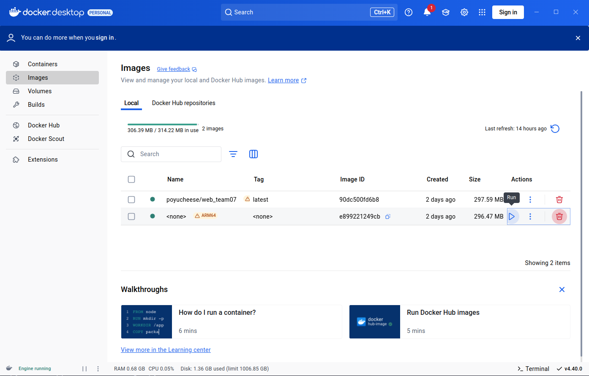

# Web Week13 Homework - Team 7

## How to run

### Docker
**Docker Image Pull 連結**
- Backend (Django) 
  ```https://hub.docker.com/repository/docker/ryan881225/backend-django/general```
- Database (MySQL) 
  ```https://hub.docker.com/repository/docker/ryan881225/hw-mysql/general```

**Docker啟動方式說明**

- Open Docker Desktop App (No need to sign in)
   </br>

- Set directory path
  ```sh
  cd HW_Report/backend
  ```

- Clearing 8001 port (Update 0508)
  - Check if 8001 port is occupied
    ```sh
    sudo netstat -tulpn | grep :8001
    ```
  - If occupied by docker, find its container ID
    ```sh
    docker ps
    ``` 
  - Stop that docker container by its ID
    ```sh
    docker stop <container_id>
    ``` 

- Pull from docker hub and run docker
  ```sh
  docker pull ryan881225/backend-django:latest
  docker compose up -d
  docker cp data.json web_django:./data.json
  docker compose exec django python manage.py makemigrations
  docker compose exec django python manage.py migrate
  docker exec -it web_django bash
  python manage.py loaddata data.json 
  ```

- 開啟瀏覽器輸入 127.0.0.1:8001/admin, Username 和 Password 分別輸入 admin 和 123456, 即可進入我們的 Django 資料庫後端

### React

- Set directory path
  ```sh
  cd HW_Report/my-shopping-platform
  ```

- Command
  ```sh
  npm run dev
  ```

- Click the given link
   </br>

## 當週上課的主題練習

### LLM 串接
  - 請參考「與當週上課的主題相關的額外程式技術」

### JWT（JSON Web Token）登入功能
  - 此功能之前已實作過
  - 我們使用 JWT 實現前後端分離的身份驗證。
  - 登入後伺服器發出一組 Token，前端儲存並在之後每次請求時附帶 Token 以驗證身份。

### Django Rest Framework（DRF）
  - 此功能之前已實作過
  - 利用 DRF 建立 RESTful API，使前後端能以 JSON 資料格式交換資訊。
  - 提供模型序列化、自動路由、驗證、權限控制、資料分頁等功能，加速開發流程。

### 使用者行為分析
  - 紀錄與分析使用者在網站上的互動，例如: 加入購物車。
  - 未來資料集更龐大之後可用於改善介面設計、強化推薦系統或進行商業決策。

### Form
  - 主要目的是讓使用者能在網頁上填寫資料，並將資料送至後端處理，實現前後端的資料交換流程。
  - 前端表單收集資料: 使用 HTML 和 React 框架建立表單，讓使用者輸入資料
  - 後端透過 DRF 的 Serializer 處理資料: 使用 Serializer 驗證前端傳來的資料是否符合格式, 驗證通過後可儲存到資料庫

### 使用者註冊
  - 此功能之前已實作過
  - 本功能讓新使用者能夠在平台上建立帳號，透過輸入基本資料完成註冊，並能安全地登入系統使用各項功能。

## 與當週上課的主題相關的額外程式技術

### LLM 串接

- 在前端介面中新增「商品詳細資訊」頁面, 呈現單一商品的圖片、價格、說明、剩餘數量等基本資訊。該頁面同時整合 AI 聊天助手，使用者可即時詢問商品相關問題，獲得智能化的回應。

- 後端透過呼叫 Google Gemini API 串接大型語言模型，處理使用者輸入並生成回應。前端將使用者輸入的問題傳送至後端，後端透過 Gemini API 處理並回傳回答，前端再呈現在聊天介面上。

- 為了讓 AI 助手更貼合網站功能與使用者需求，我們進一步自訂了 LLM 的回應角色與行為設定:
  - 角色定位：設定 AI 為「購物網站商品顧問」，以協助使用者理解商品用途、規格、搭配建議等。
  - 語氣風格：使用親切、簡潔、實用的語氣進行回覆，避免過於學術或冗長的表達。
  - 回答範圍限制：限制 AI 回應內容聚焦於該商品的相關資訊，不進行不相干或超出平台範圍的建議。

- 實作畫面截圖:
   </br>

### 「忘記密碼」功能

- 本功能提供使用者在忘記帳號密碼時，能夠安全地重新設定密碼，流程如下：
  1. 填寫信箱: 使用者在「忘記密碼」頁面輸入註冊時使用的電子郵件信箱。
  2. 寄送重設連結: 系統透過該信箱寄送一封含有「密碼重設連結」的郵件, 此連結內含一組安全的 Token，用來驗證使用者身份。
  3. 點擊連結重設密碼: 使用者點擊信中的連結後，會被導向一個「重設密碼頁面」。使用者可在此輸入新的密碼。
  4. 完成重設: 系統驗證連結是否合法且未過期後，儲存新的密碼，並提示使用者重設成功。

- 考量目前系統尚處於開發或測試階段，註冊帳號多為隨機填寫的測試用帳號（並非實際存在的電子郵件），因此我們會在信箱通過驗證後, 將重設密碼之連結直接顯示在網頁上, 點擊該連結後即可導到重設密碼之頁面。

- 測試時請先創一帳號進行測試


## 組員分工情況
- 陳星佑 25% Fix Django css, everything related to LLM
- 高永杰 25% Frontend part of resetting password, readme file writer
- 渠景量 25% Backend part of resetting password, docker management
- 林柏佑 25% User behavior analysis


